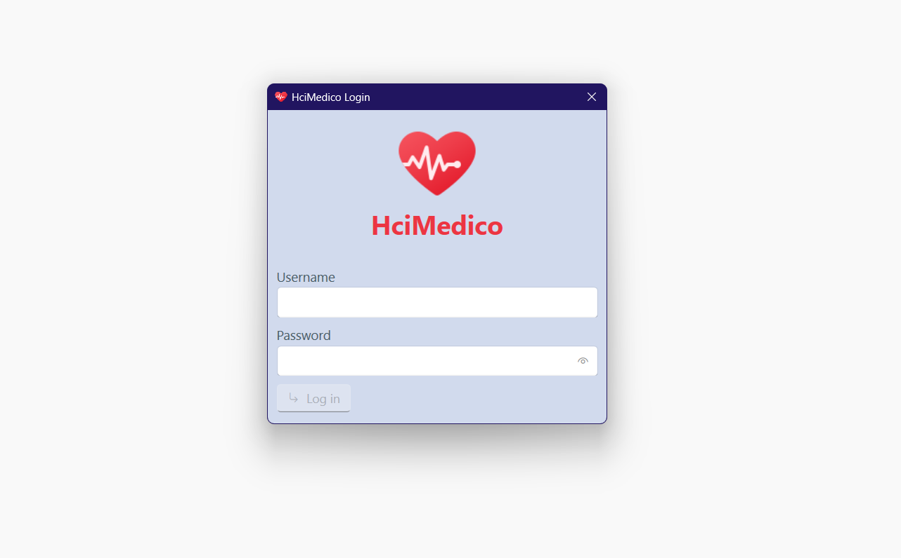
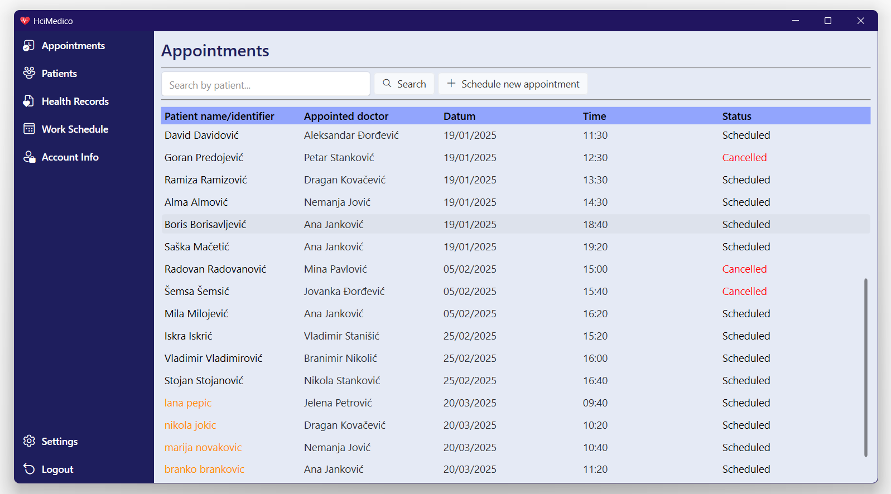
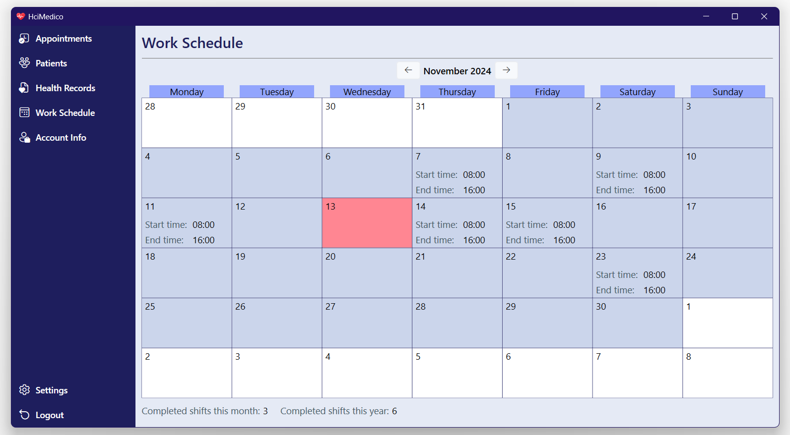
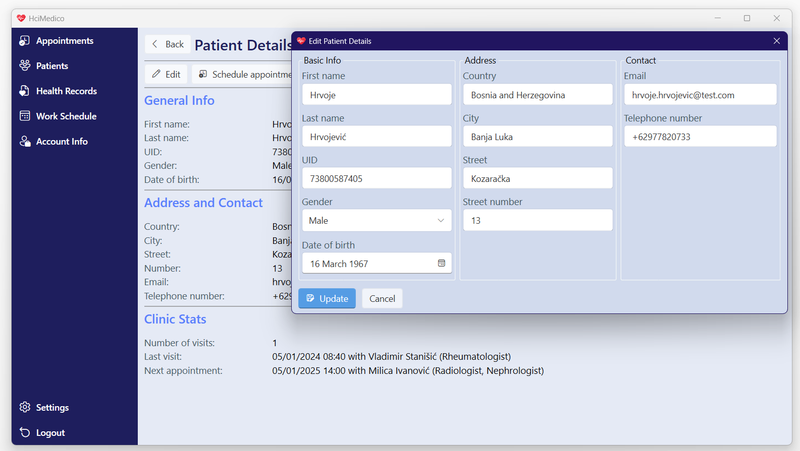

# HciMedico

### About

Simplified version of software for scheduling and managing appointments in health care institutions, as well as patient and employee data. It supports interaction through two types of accounts - counterworker and doctor.  

&nbsp;

Set of functionalities that are supported but may be limited to only a specific account type:

- viewing all incoming and assigned appointments as well as their full details
- searching appointments
- scheduling, rescheduling, reassigning, cancelling and resolving appointments
- auto-cancelling unresolved appointments
- detection of available time slots for appointments based on selected doctor and patient
- creating and viewing medical reports
- registering patients
- viewing all and treated patients as well as their details
- searching patients
- viewing all and treated patient health records as well as their details
- searching health records
- creating, viewing and exporting medical reports to .pdf
- viewing employee work schedule in a calendar form (only for presentation purpose, currently there is no support to interact with this data nor does it participate in business logic)
- viewing employee and account information
- settings to change password, set landing page and swap between english and serbian language (per user)

&nbsp;

Some functionalities that were intended but not yet added:
- editing health records
- additional account type for registering new accounts and controlling existing ones
- locking account for incorrect password input
- two or more color themes
- exporting medical report to more formats
- emailing medical report to a patient

&nbsp;

### Technical stuff

Application is implemented in WPF. MySQL is used as a database along with Entity Framework Core for interaction.

Solution also utilizes:  
- WPF-UI & ToastNotifications for UI components
- Caliburn.Micro for MVVM
- Serilog for logs
- xUnit & Moq for unit tests

Application follows generic repository pattern.

### Database setup

To create and seed a database, either execute <b>create_and_seed_db.sql</b> script or apply migration by opening up terminal in <i>HciMedico.Integration</i> project folder and running command  
```sh
dotnet ef database update --startup-project ../HciMedico.App/HciMedico.App.csproj
```  
Seeded accounts have the same password as their username. Use ksenija.markovic31 and marko.petrovic1 for testing.

Note: logical inconsistencies may be present within the test data.

### Few screenshots




